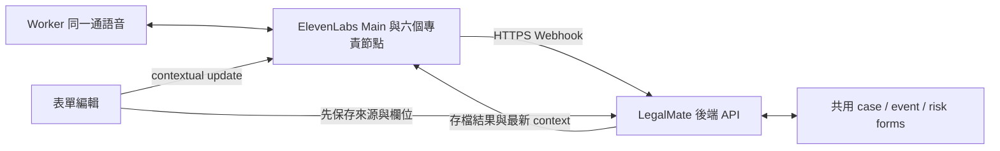

# ElevenLabs Workflow × LegalMate 接線規格

更新：2026-09-14（Melbourne）。原生 Workflow 與後端 Webhook 已實作於隔離測試；正式 agent、正式 DB 與既有錄音介面尚未切換。實測結果見 [workflow-backend-results.md](./workflow-backend-results.md)，較早的 client-tool 可行性實驗保留在 [workflow-lab-results.md](./workflow-lab-results.md)。

## 執行路徑



ElevenLabs 決定這一輪由哪個角色追問，LegalMate 決定資料屬於哪份記錄、是否有效與是否存檔。Codex 協助設定及測試，不在每輪語音的執行路徑上。

Main → Medication 是同一 agent、同一 conversation 裡的原生 workflow transition。實際事件的 `transfer_to_agent` 前後 agent ID 相同，`to_node` 改變。專責節點直接產生下一個問題；沒有後端先呼叫另一個 LLM，再請 Main 複誦的流程。

## 已由 API 建立的設定

測試 agent：`LegalMate — Backend workflow test`，ID `agent_1401m2dg91jjeve939wtx6t9qwh6`。Graph 是 Start、Main、六個專責節點，共八個節點與七條連線。每一條 Main ↔ specialist 連線有 forward / backward 條件。

六類是 Incident/Safeguarding、Health/Wellbeing、Medication、Behaviour/ABC、Restrictive Practice、Service Exception。Complaint 不在此六類中。

| 設定                           | 實作位置／行為                                                            |
| ------------------------------ | ------------------------------------------------------------------------- |
| 共同身份、語言、來源與存檔規則 | `workflow-backend-config.mjs` 的 base prompt                              |
| 六種追問能力                   | 各 `override_agent` 節點的 additional prompt；欄位來自同一後端 schema     |
| 聲音／模型                     | 沿用同一聲音，模型可選已核對的比較候選；沒有新增路由模型                  |
| 進入 specialist                | 新事件／pending 表單先由專責節點處理；已回答的內容不重問                  |
| 返回 Main                      | 最新 `save_risk_form` 回傳 `ok:true`，並標為 handled 或 deferred          |
| Main 更正                      | 已理解的簡單更正直接呼叫 save，不重新進入 specialist                      |
| 防循環                         | `prevent_subagent_loops:true`；返回 Main 後先說話、等待下一次 worker 回覆 |
| 版本                           | 後端取得連線時指定 `version_id`；測試 manifest 記錄實際版本               |
| 更新工具／agent                | setup script 只更新其擁有的隔離 agent 與兩個工具，拒絕修改正式 agent      |

自然語言路由條件仍由模型判斷，不是資料庫條件。平台防循環與後端防重複各負責不同問題；不能把「已切回 Main」當成資料已保存的證明。

## 只有兩個共用工具

| 工具               | ElevenLabs 設定                                               | 後端責任                                                                      |
| ------------------ | ------------------------------------------------------------- | ----------------------------------------------------------------------------- |
| `get_case_context` | Webhook GET `/api/workflow/tools/context`，模型不提供 case ID | 由短效 session token 找出目前 case，回傳 revision、事件、已答欄位與來源       |
| `save_risk_form`   | Webhook POST `/api/workflow/tools/save`                       | 驗證 risk type、event ID、欄位、來源和 revision，保存 patch，回傳最新 context |

save 參數為 `risk_type`、`expected_revision`、`fields_json`，既有事件加 `event_id`；結束追問時加 `followup_status: handled | deferred`。HTTP 成功不等於存檔成功，必須看 JSON 的 `ok`。

```json
{
  "fields": {
    "scheduled_time": {
      "value": "13:00",
      "state": "known",
      "source_ids": ["form:scheduled"]
    },
    "medication_name": {
      "value": null,
      "state": "unknown",
      "source_ids": ["worker:1"]
    }
  }
}
```

共同事件內容放 `fields_json.shared_fields`，專屬內容放 `fields_json.fields`。`unknown` 是明說不知道，`not_discussed` 是未談及，`not_applicable` 需要明確依據。不能因為尚未提到，就寫成「沒有」。

工具 Authorization 由 `secret__workflow_token` 動態變數帶入完整 `Bearer …` 值，不放進 prompt。後端只存 token hash，綁定 owner、case、conversation 和版本，15 分鐘到期，可主動關閉。Agent 不可自行選擇病人或來源。相同寫入有 receipt 去重，舊 revision 拒絕覆寫；同一錯誤最多修正一次，單 session 工具呼叫也有上限。

## 共用資料與 context

```text
workflow_cases: note_id + owner_id + revision + state_json
  events[event_id]
    shared_fields: 事件時間、人物、經過、處置、通知等
    risk_forms[risk_type]
      fields: 該類專屬欄位
      followup_status: pending / handled / deferred
      handled_revision
  sources: 當前 worker 陳述／表單編輯／背景資料
workflow_sessions: token hash、到期時間、關閉狀態、agent/version
workflow_receipts: 請求指紋、接受版本、重試次數
```

同一事件可連到多種表單，共同事實只存一份；第二個獨立事件另建 event。共同事實變更會讓相關表單需要重新檢視。資料存在 D1，不需要 Google Sheet，也不需要為本次接線新增向量資料庫。

結構化表單編輯來源可附 `field_path`，例如 `medication.scheduled_time`。這份來源只能支持指定欄位，不能拿預定給藥時間去填事件發生時間。自由語句的引文存在只代表來源可追溯，仍不保證模型解讀完全正確；表單需要人工檢視。

1. 開始前，後端按登入者與 draft note 建立 session，注入精簡的 `case_context`。
2. worker 新陳述先保存為 source；表單修改保存 source 與欄位後，送出最新 context。
3. 工具保存後直接在 tool result 回傳最新 snapshot，覆蓋較舊 contextual update 的語意狀態。
4. 原生切換節點沿用同一通話，不逐節點重新 RAG。只有缺資料、過期或恢復錯誤時才 GET context。
5. Review 前關閉通話；risk draft review 綁定 case 與 note 最新 revision。它不會自行確認 General Note。

RAG 適合較長的照護計畫或歷史資料；當前表單按 ID 讀取。歷史內容只作背景，不能用來支持本班發生的事。此測試 agent 關閉 RAG，避免將患者資料寫入全域共用知識庫。

## 如何重跑

先完成專案 build，再執行：

```sh
npm run test:workflow
npm run test:workflow:live -- all --audio --model=qwen35-397b-a17b
```

第一個命令使用隔離 D1 與模擬 provider，檢查 API 與持久化。第二個使用真正 ElevenLabs 連線與語音輸出，建立合成測試帳號、draft 和 D1，透過暫時 ngrok gateway 讓 ElevenLabs 呼叫兩個 Webhook。其他路徑一律 404，測試後關閉 gateway、session 和 tunnel。

本機需既有 ngrok 設定及 `.env.local` 裡的 ElevenLabs key。不將 key、signed URL、Authorization header 存入報告。這是有費用、有限次數的合成測試；manifest 的 session 上限為 20；目前共執行 15 個隔離 session，失敗會中止該批次，沒有把未執行情境計入通過數。

正式 runtime 的獨立開關是 `LEGALMATE_WORKFLOW_ENABLED`；另需 `ELEVENLABS_WORKFLOW_AGENT_ID` 與 `ELEVENLABS_WORKFLOW_VERSION_ID`。預設關閉。不要把目前暫時 tunnel URL 當成長期 webhook。

## 正式 App 接線尚需完成

後端設定與測試已涵蓋 workflow、六種結構化 draft、Webhook、版本綁定及保存。既有 recorder UI 仍使用 `get_form_context`／`update_and_check_form`，沒有接到新的 workflow session，也沒有六種可編輯 risk form。要讓 worker 在正式產品使用，還需：

- 表單介面共用上述 schema，接上新 session API；按實際 transcript 事件保存來源並協調工具寫入的先後。
- 將一般 note 記錄與 risk 表單 review 接進同一使用流程，實測麥克風、打斷、斷線、重連及手動更正。
- 部署穩定 Webhook 地址、套用 migration、指定驗證過的 agent/version，再啟用 workflow 開關。

`scripts/sync-elevenlabs-agent.mjs --apply` 目前仍會寫回正式 recorder-only prompt。模式整合前不要用它覆寫新 workflow。隔離 setup script 是這次測試配置的唯一來源；Dashboard 調整需要同步回程式，避免下次 API 更新覆蓋。

## 官方來源

- [Workflows](https://elevenlabs.io/docs/eleven-agents/customization/agent-workflows)：subagent、tool node、forward/backward edges。
- [目前 OpenAPI](https://api.elevenlabs.io/openapi.json)：實作以真實 API schema 為準，`workflow` 位於 create/update body 頂層。
- [Server tools](https://elevenlabs.io/docs/eleven-agents/customization/tools/server-tools)：Webhook 工具。
- [Dynamic variables](https://elevenlabs.io/docs/eleven-agents/customization/personalization/dynamic-variables) 與 [Client events](https://elevenlabs.io/docs/eleven-agents/customization/events/client-to-server-events)：啟動 context、動態 header 與執行中更新。
- [Signed URL](https://elevenlabs.io/docs/eleven-agents/api-reference/conversations/get-signed-url)、[WebRTC token](https://elevenlabs.io/docs/eleven-agents/api-reference/conversations/get-webrtc-token)、[Versioning](https://elevenlabs.io/docs/eleven-agents/operate/versioning)：連線及版本選擇。
