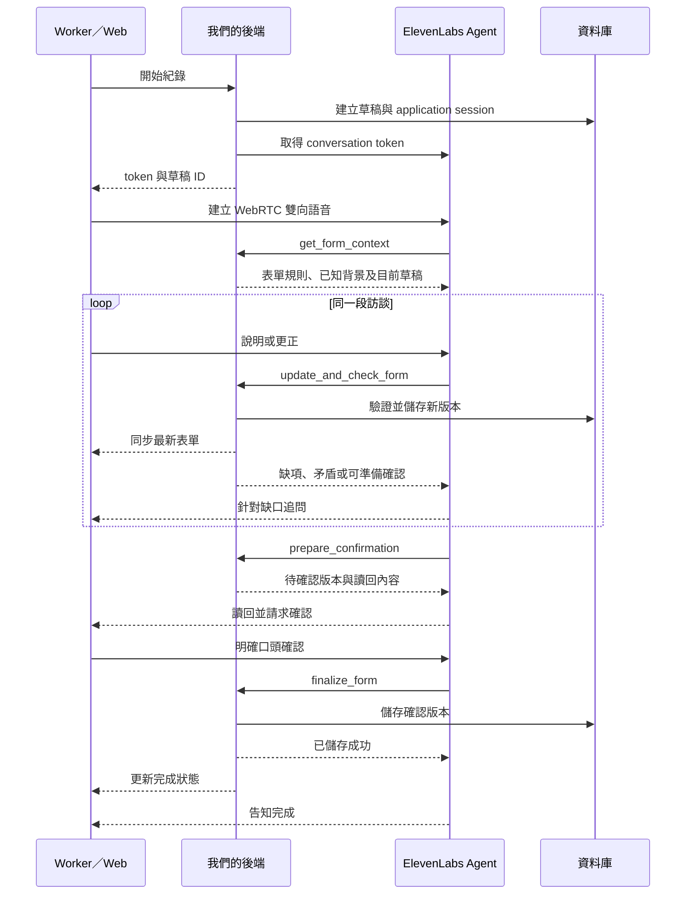

# LegalMate — MVP 需求

更新日期：2026-09-13。

GitHub 版本包含可執行的 Web app 與需求文件。文中的原始 `web/` 路徑對應本 repository 根目錄；`sample_form/` 與研究資料仍保留在原工作區，未隨程式碼上傳。

本文件記錄本次對話已確認的需求，以及為落實需求提出的技術方案。產品範圍與 `IDEA.txt` 不一致時，以本文件記錄的最新使用者決定為準。第 1–7 節記錄需求與初始方案；第 8 節記錄實作進度。

## 1. 已確認的產品範圍

- **只做 Web。** 使用者透過瀏覽器操作，不開發原生 iOS／Android app。
- **產品同時協助 support workers 與 service providers。** Worker 的核心情境是剛下班、從空白班次表單開始；Provider 透過 managers 管理團隊紀錄與覆核。最新帳號與入口決定見第 9 節。
- **核心體驗是一次完整語音對話完成紀錄。** AI 在同一段對話中聽取敘述、填表、追問缺項、接受更正及確認內容。
- worker 不需要先寫好 shift note，也不需要每答一題就停止錄音或切換到另一個填表步驟。
- **Worker 與 Manager 使用不同工作介面。** Worker 在 `/worker` 訪談及填寫紀錄；Manager 在 `/manager` 操作管理看板。新版根目錄改為手機優先的身分選擇與原頁展開入口（見第 9 節）；worker 畫面不放主管控制項。
- **主管端先做實用的簡單版本。** 本次新增事件覆核、通知時間線、原始對話與編輯紀錄、限制性措施及月報／nil-return 提醒；進階趨勢分析仍非本次範圍。
- **正式表單仍由使用者準備。** 尚未確認欄位、必填條件、條件式問題、版面及輸出格式。專案內的 `sample_form/` 是參考材料，不代表已選定正式模板。
- **全部英文。** 介面、語音對話及產出紀錄均使用英文。
- **先做簡單版本。** 使用者已確認 ElevenLabs API key／Agent 尚未準備，先實作其餘部分；語音不可用時須如實標示。

## 2. Worker 的主要流程

1. 開啟這次班次的空白表單，按「開始語音紀錄」。
2. 系統取得麥克風權限，建立對話。已知的 worker／個案／班次背景可供確認；缺少的資訊在對話內詢問。
3. AI 先邀請 worker 自由描述這次班次，不要求照欄位順序回答。
4. 每輪取得新資訊後更新同一份表單草稿，畫面同步顯示已填內容。
5. AI 根據仍缺少的資料、模糊描述及矛盾處提出下一個問題；已清楚回答的資訊不重問。
6. worker 可隨時口頭更正，例如「剛剛時間講錯，是五點結束」。修正應更新原欄位。
7. AI 在同一段對話中讀回重要內容及仍待確認的項目，讓 worker 更正或明確確認。
8. worker 確認當前版本且後端儲存成功後，顯示完成的紀錄，並讓主管端可查閱。

### 資料與完成條件

- 草稿可持續儲存；「結束通話」本身不代表 worker 已確認內容。
- 沒有提到的事情保持未知，不能自動填成「沒有發生」。AI 不得為了填滿表單推測事實。
- 明確的「不知道／不適用」與未回答應分開記錄；是否容許完成，依正式表單的欄位規則決定。
- worker 確認的是特定版本；確認前又修改資料時，須更新讀回內容並重新確認。
- 紀錄已完成與內容是否需要主管覆核分開表示，不把完成紀錄等同全面合規認證。
- 斷線或工具失敗時保留已成功儲存的草稿，顯示真實狀態。恢復後接續同一筆紀錄，不能靜默建立重複紀錄。

## 3. 建議的最小畫面範圍

以下是對「Web、worker 優先、主管簡單」的初步落地方案。

| 畫面        | 第一版內容                                                             |
| ----------- | ---------------------------------------------------------------------- |
| Worker 入口 | 開始這次紀錄、返回未完成草稿；已知班次資料可作為背景。                 |
| 語音交班    | 開始／靜音／結束、連線及儲存狀態、對話文字、同步表單草稿、待補項目。   |
| 紀錄詳情    | 已確認內容、確認時間、待覆核項目。文件匯出形式待正式模板確認。         |
| 簡單主管頁  | 紀錄清單、基本狀態篩選、點開查看內容及待覆核項目；從實際儲存資料讀取。 |

## 4. 語音技術方案（建議）

### 4.1 系統分工

- **Web 前端：**處理麥克風、播放 AI 語音、呈現對話與表單，管理連線狀態。React 與 `@elevenlabs/react` 是可行的串接選項，完整前後端框架尚未鎖定。
- **ElevenLabs Agents：**管理雙向語音、辨識與回覆、輪流說話及工具呼叫，依表單狀態進行訪談。[React SDK](https://elevenlabs.io/docs/eleven-agents/libraries/react)
- **我們的後端：**提供表單定義與受授權的背景資料，驗證欄位、儲存草稿、計算缺項、管理版本及確認狀態。
- **資料庫：**保存 application session、班次／表單資料、版本與確認紀錄。資料庫和部署供應商待實作時選定。
- **文件輸出：**使用確認後的結構化資料套入選定模板；格式與欄位映射等待正式表單。

### 4.2 一次對話的執行順序

1. 前端向我們的後端建立 application session／空白草稿。後端確認使用者可操作該紀錄，取得 ElevenLabs 的 conversation token。
2. 前端用 token 建立 **WebRTC** 語音連線，麥克風與 AI 聲音在瀏覽器和 ElevenLabs 之間傳輸；ElevenLabs API key 留在後端。此 token 是 Agents 的通話 token，不是獨立 Scribe 的轉錄 token。[React SDK 連線方式](https://elevenlabs.io/docs/eleven-agents/libraries/react)
3. Agent 取得這份表單的欄位規則與已知背景，開始訪談。
4. Agent 每取得一組可用的新答案或更正，即在通話中呼叫後端工具，提交欄位變更。後端驗證、存檔並回傳最新版本、缺項與需釐清的內容。[Webhook tools](https://elevenlabs.io/docs/eleven-agents/customization/tools/webhook-tools)
5. Web 前端接收後端的最新表單狀態並重新顯示。建議用 SSE 推送，或在 MVP 使用短輪詢；資料庫中的版本是共同依據。
6. Agent 根據工具結果決定下一個追問，再把問題說給 worker 聽。對話持續，不需要 worker 重新按錄音。
7. 完成收集後，後端建立待確認版本。Agent 讀回，取得針對該版本的明確口頭確認，再呼叫完成工具。
8. 後端儲存成功才回覆完成；Agent 告知 worker，前端及主管頁讀取同一份結果。

### 4.3 建議的通話中工具

| 工具                    | 職責                                                                   |
| ----------------------- | ---------------------------------------------------------------------- |
| `get_form_context`      | 取得表單定義、已知班次背景及目前草稿。                                 |
| `update_and_check_form` | 接收增量答案／更正、驗證與存檔；回傳版本、缺項、矛盾及下一題所需資訊。 |
| `prepare_confirmation`  | 檢查是否可進入確認，產生對應特定版本的讀回內容。                       |
| `finalize_form`         | 驗證確認版本、完成條件與明確確認紀錄，儲存最終狀態。                   |

- 模型負責理解敘述及提問，後端負責正式狀態；不能只靠 Agent 說「完成了」來判定完成。
- 工具必須等待後端結果，再決定下一句；失敗時不得宣稱已儲存。
- 工具請求應驗證呼叫身分及 application session 的存取範圍，不能單憑模型傳入的 worker／個案 ID 授權。
- 更新帶版本與冪等識別，避免重試、重複工具呼叫或較晚抵達的舊更新覆蓋新答案。
- 保存 application session 與 ElevenLabs conversation ID 的對應。重新連線可能產生新的通話 ID，但應接續原本已儲存的草稿。
- Data Collection／Evaluation 作為通話後的分析選項，不作為通話中填表和追問的依賴。[Post-call webhooks](https://elevenlabs.io/docs/eleven-agents/workflows/post-call-webhooks)

## 5. 表單與檔案尚待確定的部分

- 正式模板、欄位名稱／型別、必填規則、條件分支、確認與輸出要求，由準備中的表單決定。
- 實作時以表單 schema 驅動畫面、工具欄位驗證和缺項檢查，避免三處各自維護不同規則。
- 在模板交付前可做示範 schema，但須標為暫定，不把示範欄位當成正式需求或官方要求。
- 照護計畫、BSP 等既有文件可作為受授權的背景資料；本次 worker 交班流程不以先上傳文件為必要步驟。
- 匯出 PDF／DOCX、是否需填回原檔，以及是否需額外事件表單，均待正式模板及工作範圍確認。

## 6. 第一版驗收重點

- worker 能從空白表單開始，在一段語音訪談中敘述、補答、更正及確認。
- 一段敘述能填入多個相關欄位；表單顯示的是後端已接受的最新資料。
- AI 會追問必要缺項，且不把未提及內容填為否定或自行猜測。
- 口頭更正能取代錯誤答案，並使舊的待確認版本失效。
- 掛斷、拒絕麥克風權限、網路或工具失敗不會把草稿誤標成完成。
- 確認後只產生一份對應版本的完成紀錄；主管簡單清單可以開啟同一份內容。
- 正式欄位覆蓋率與完成條件的驗收，待表單交付後補齊。

## 7. 本次範圍與後續事項

- 本次先按 Web 內語音對話設計；實際電話號碼、撥入／撥出、Twilio／SIP 未列為需求。
- 原生手機 app、進階主管分析、正式月報自動提交及政府系統自動提交不列入目前最小流程。管理看板提供月報／nil-return 準備提醒，不代表已提交。
- 後續需確定：正式表單、登入／班次資料來源、展示用資料、模型／聲音配置及資料保留設定。

## 8. 第一個開發切片（2026-09-12）

- Web 原始碼放在 `web/`，以 Sites 的 Vinext starter 與 D1 儲存建立初版。
- 本次先實作英文示範表單、草稿儲存、欄位與條件檢查、版本化確認、紀錄清單與文字匯出。
- 正式模板仍待提供；當前欄位與完成規則明確標為 demo，不作為官方表單要求。
- 私人展示版的紀錄依登入使用者隔離；簡單主管頁目前查看該使用者的紀錄，尚未加入跨 worker 的組織角色管理。
- 初始切片先保留手動填表；最新語音接入進度見 8.2。
- 私人 Sites 預覽若使用語音，建議先由 client tools 經登入瀏覽器轉呼叫現有 API；前述 server webhook 方案待公開 callback 與授權配置支援後再接。

### 8.1 ElevenLabs 帳號設定進度

- 使用者已明確同意 ElevenAgents 條款；已建立並發布 `LegalMate Shift Notes — Demo` Agent 的英文訪談設定。
- 已建立四個等待回應的 client tools：`get_form_context`、`update_and_check_form`、`prepare_confirmation`、`finalize_form`。
- Agent 要求驗證，採後端取得短效 token 的接入方式；使用者之後已填入 API key，接線進度見 8.2。
- Web 保留手動填表及確認流程。Agent 設定詳見 `docs/elevenlabs-agent.md`。

### 8.2 語音接線（2026-09-12）

- 使用者已在 `web/.env.local` 填入 API key；後端已成功取得 ElevenLabs conversation token。金鑰不進 Git 或前端。
- 已加入 React SDK／WebRTC、開始／靜音／結束通話、即時文字及四個 client tool 執行器，經登入瀏覽器呼叫同一組儲存 API。
- 一段通話綁定同一草稿及 provider conversation ID。更正清除舊確認；結束通話等待既有存檔收尾，再容許重開。
- 口頭完成要求新一輪明確說出 **I confirm this shift note.** 後端核對最新 note revision、confirmation ID、voice session revision 及 SDK 使用者轉錄；不是只接收模型產生的 confirmed 布林值。
- 轉錄證據存於 D1，並非獨立音訊驗證；SDK 的 speaking/listening 不能嚴格證明每字均已播放。實際追問、朗讀與辨識品質仍須由使用者用麥克風跑一輪驗收。
- 前述 webhook／SSE 是初始建議；本次 MVP 採 client tools 與 API 回應同步，未加入 webhook 或 SSE。
- 正式表單、跨 worker 主管權限、資料保留與正式個資使用仍待後續確認。測試步驟在 `web/docs/voice-integration.md`。

### 8.3 暫時文字測試模式（2026-09-12）

- 使用者要求把說話暫時改成打字，方便測試表現，保持相同思考／訪談流程。
- 預設 Text · Test mode，可在開始前切回 Voice。兩者使用同一 ElevenLabs Agent、model、system prompt、四個表單工具與版本確認規則。
- 文字使用 signed WebSocket URL 與 textOnly，不要求麥克風；使用者送出的文字先保存，再交給 Agent。確認證據標示 text，與語音轉錄分開。
- 畫面提供可捲動對話、輸入框、Send、Enter 送出、Shift + Enter 換行。更正仍使舊確認失效；閱讀最新摘要後輸入 I confirm this shift note. 才完成。
- 文字測試可驗證理解、追問、工具存檔及更正；不涵蓋辨識準確度或聲音播放延遲。
- 驗證：11 項表單／確認邏輯測試、36 項語音 API 相容性檢查通過；真實 Agent 文字對話完成填表、修改結束時間、重新讀回及文字確認。觀察到 Agent 可能只宣告將準備摘要而結束回合，測試用下一則使用者訊息要求 review 後可完成；app 不自動插話，也未修改 Agent 指令。

### 8.4 Shift-note spec 與分開的管理視窗（2026-09-12）

本次使用者要求實作 `/Users/chien/Downloads/shift-note-agent-spec.md`，並新增 management board；後續明確要求 worker 與 manager 各自使用不同視窗。以下為本次交付範圍，取代前述單一簡單主管清單方案；發布與驗證結果以本次完成回報為準。

- `/`：選擇 Worker workspace 或 Manager board；兩個入口可開在獨立瀏覽器分頁／視窗。
- `/worker`：空白班次草稿、四位虛構個案的 profile picker、文字／語音訪談、同步欄位、限制性措施細節、覆核確認及 My notes。預設保留 Text · Test mode；Voice 使用相同 Agent、工具與記錄規則。
- `/manager`：獨立管理看板，包含待覆核事件、嚴重度篩選、記錄查閱、原始 transcript／draft_v0／修改歷程、事件及通知時間線、限制性措施月報與無紀錄時的 nil-return 核對提醒。
- **此 demo 使用相同登入帳號、依記錄 owner 隔離資料。** 兩個視窗是工作介面分流，不是已完成的 worker／manager 角色權限系統。跨 worker 團隊資料、組織管理及正式 RBAC 仍需之後實作。
- **即時通知先使用 in-app manager inbox。** 偵測到候選事件即可入列，不等草稿確認；未接 email、Slack、SMS 或其他外部通知。不能宣稱主管已讀、已收到外部通知或已通知 Commission。
- 分開保存事件發生、app 捕捉、inbox 入列、provider 實際知悉、Commission 通知等時間；主管輸入實際知悉時間與來源，不把 inbox 時間直接當法定知悉時間。
- 所有欄位新增 `stated_positive`、`stated_negative`、`not_reviewed`。未提及預設 Not yet reviewed；「No incidents／None」必須有明確 worker 證據，不能由沉默或「all good」推定。
- 口語中的鎖門、限制取得物品、抓握或其他限制性措施也要偵測。worker 只確認觀察事實，不負責判斷是否 reportable；不同意分類時保留原始事實與候選旗標，交主管覆核。
- 新增限制性措施資料、計畫項目與使用限制比對。個案計畫、州授權及本次使用是否符合限制分開核對；worker 不知道計畫不直接等於未授權。
- 使用虛構 profile 做最多三次風險優先的觀察性追問；完整敘述不加問無必要問題。不得診斷、提出臨床假說或增加 worker 未說的因果。
- 保存 app 層 append-only 對話、首次準備覆核的 `draft_v0`、每次欄位前後值及編輯者／時間；風險內容被移除或矛盾的否定敘述交主管覆核。開場明示 transcript 被記錄及保留，說明原始陳述可在後續編輯後保護 worker。
- 保留至少七年的 metadata；四個示範個案未提供 DOB，未成年延長保留條件仍標為待核對。這是 demo 的保留策略，不能宣稱「至 25 歲」是所有 NDIS 記錄的統一法定要求。

### 8.5 規格中的申報文字修正

- 未授權限制性措施一般為 provider 知悉後五個工作天；造成 harm 或屬其他 24 小時通報類別時，可能適用 24 小時。未知 harm 或授權狀態應保留不確定性，交負責人評估，不能由模型作最終法律判斷。[NDIS Commission guidance](https://www.ndiscommission.gov.au/rules-and-standards/reportable-incidents-and-incident-management/reportable-incidents)
- 月報與 incident reporting 可同時適用；當月沒有 app 記錄不等於實際零使用，因此只能提醒核對 nil return。使用超出計畫的限制仍需事件覆核。[Implementing providers](https://www.ndiscommission.gov.au/rules-and-standards/behaviour-support-and-restrictive-practices/rules-implementing-providers)
- 新 Agent prompt 的可複用原文放在 `docs/elevenlabs-system-prompt.txt`；開場放在 `docs/elevenlabs-first-message.txt`。正式表單、真實個資使用、clinical sign-off 及正式組織權限不由此次 demo 自動完成。

## 9. Provider／Manager／Worker 與登入改版（2026-09-13）

本節記錄最新產品決定，優先於前述初始入口及帳號方案；第 8 節仍是歷史實作紀錄。初次分支實作紀錄見 9.4；目前發行設定以 9.5 的最新決定為準，外部服務設定與部署狀態另行核對。

### 9.1 已確認的產品方向與入口

- 產品同時協助 support workers 與 service providers：worker 端減輕班後紀錄負擔；provider 端支援團隊紀錄管理、覆核與跟進。兩端均為核心使用情境。
- **Provider 是服務機構；Manager 是獲授權操作該機構管理端的個人帳號；Worker 是撰寫班次紀錄的個人帳號。** 不把 provider 與 manager 當成同一種資料實體。
- 保持英文 Web app，優先手機使用。首頁只保留品牌、slogan 與清楚的身分入口，移除額外功能清單及冗長展示說明。
- Slogan 精確使用 **better note, less burden**。
- 入口使用清晰的社福用語 **Service provider**、**Support worker**；點擊後在原頁展開相應登入／開始使用內容，worker 與管理端保留各自工作介面。
- 目前發行版只提供 **Continue with Google**，不提供其他登入選項。原先的 Email 一次性驗證碼登入已依最新決定延後，首頁不顯示 Email 登入按鈕、驗證碼表單或寄信設定提示。

### 9.2 已確認的開通方式

- **不開放線上自行新增 provider。** 新機構先與我們洽談，再由我們建立 provider 並開通第一個 manager account。
- Provider 入口供已開通的 managers 登入；新機構可看到聯絡洽談入口，不提供公開建立機構或自行取得 manager 權限的流程。
- **Worker 第一版可自行選取已存在的 provider 並登入使用。** 首次使用需完成基本資料與所屬 provider 選擇；不要求 manager 預先建立 worker、先發邀請或先審批。
- 上述 worker 直接開始使用的決定，取代先前提出的「加入需 manager 確認」建議。
- 新機構開通及第一位 manager 的身分配置由我們處理；不得因使用者點選 Service provider 入口，就自動授予管理權限。

### 9.3 資料與權限設計

- 新增穩定的 app user、worker profile、provider、worker membership 與 manager grant 資料，替換先前同 owner 的展示授權。
- Worker 自選 provider 後即可建立自己的紀錄；只看自己的紀錄。Manager 依正式授權查看與覆核所屬 provider 的紀錄及必要證據。
- 自選 provider 不自動取得 manager 權限、其他 workers 的紀錄，或整個機構的完整個案與照護資料；共享個案背景的可見範圍另行設計，不以此阻擋 worker 直接註冊。
- 在 worker 選擇 provider 的步驟，簡短說明紀錄會分享給該機構 managers。一般草稿、已確認紀錄與既有風險 inbox 的可見時點須分別定義，不把所有草稿或既有即時風險提示一概改成同一規則。
- 每份紀錄保存建立時的 provider 歸屬與原作者；worker 更換 provider 不自動搬移舊紀錄。更換登入來源時保留既有作者與 append-only 證據，可透過 identity mapping 銜接。
- MVP 基本資料採 full name、已驗證 email 與一個目前所屬 provider；多機構 worker、正式個案資料的可見範圍仍留待後續設計。聯絡洽談入口的實際目的地待提供。

### 9.4 初次分支實作紀錄（Email 移除前）

- 此節記錄首次完成時的 `feat/provider-worker-onboarding` 分支；當時尚未合併 `main` 或部署至 VM，最新發行決定見 9.5。
- 已加入手機優先的展開式首頁、Google／Email 驗證码登入、worker 基本資料頁，以及依機構授權的 manager 看板。Worker 可以直接加入已開通的 provider；manager grant 由管理員預先配置。
- 每份新紀錄保存不可變更的 provider 歸屬。Worker 換機構後，歷史紀錄仍由原機構 managers 查看；worker 仍可讀取自己的歷史紀錄。Manager 不能修改、代為確認 worker 的觀察或啟動其對話。
- Provider managers 可查看所屬機構的草稿及已確認紀錄；既有候選事件仍於捕捉時進入機構 inbox，不等紀錄確認。Worker 選擇機構時會看到紀錄分享說明。
- 登入只接受已驗證 email 與簽署的資料庫 session。移除本機 dummy ChatGPT 登入；VM 設定改用 app session，舊 Basic auth 上線切換方式另見部署文件。
- 新 migration 保留舊紀錄與 append-only 證據；舊 ChatGPT owner 不依 email 自動對應新帳號，舊紀錄也不自動指派給機構。既有資料轉移須提供可核對的 identity mapping。
- 已加入管理員用 provider／第一位 manager 開通工具，沒有公開新增機構或提升管理權限的 API。
- 本機已加入安全產生的 session secret，保留原有 ElevenLabs 設定。Google OAuth、寄信 API／驗證寄件者、實際 provider 與第一位 manager 尚未配置，因此目前不宣稱可完成真實登入。
- 43 項單元／隔離資料庫測試、38 項建置後 API 檢查、格式／Lint／型別檢查與正式建置通過；涵蓋登入驗證、OTP 過期與重播、登出、角色隔離、跨機構讀取限制，以及更換機構後歷史紀錄的歸屬。手機首頁已檢查 320px／390px 寬度，沒有水平溢出。

### 9.5 最新發行決定：暫時移除 Email 登入（2026-09-13）

- 使用者最新指示：「等等，email 先移除就好」。目前入口只保留 **Continue with Google**，manager 與 worker 使用同一個 Google 登入方式。
- 移除 Email 登入按鈕、Email／驗證碼表單、重新寄送功能及 Email 設定中的提示；保留 worker 的 provider 選擇、Google 登入錯誤與重試說明。
- Email OTP 後端及隔離測試 fixture 暫時保留供後續使用，這次發行不設定 Resend，也不對使用者開放 Email 驗證碼登入。
- 已驗證 email 仍作為 Google 帳號資料及 manager grant 核對依據；本次決定不移除帳號的 email 欄位，不改變 provider／manager／worker 權限與歷史紀錄歸屬。

- 使用者已授權將 Google credentials 寫入本機及 VM 的私密設定、合併推送 `main` 並更新 VM；指定第一個機構名稱為 **TestProvider**。登入憑證不寫入 Git。
- TestProvider 公開測試角色：`managertest@gmail.com` 為 manager，`workertest@gmail.com` 為 worker；仍須使用對應 Google 帳號完成驗證，worker 首次登入自行完成基本資料與機構選擇。
